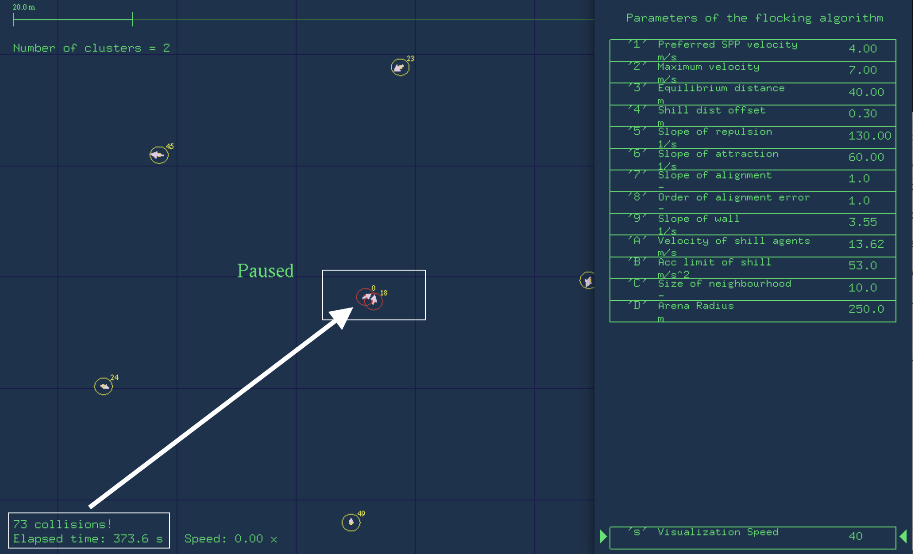
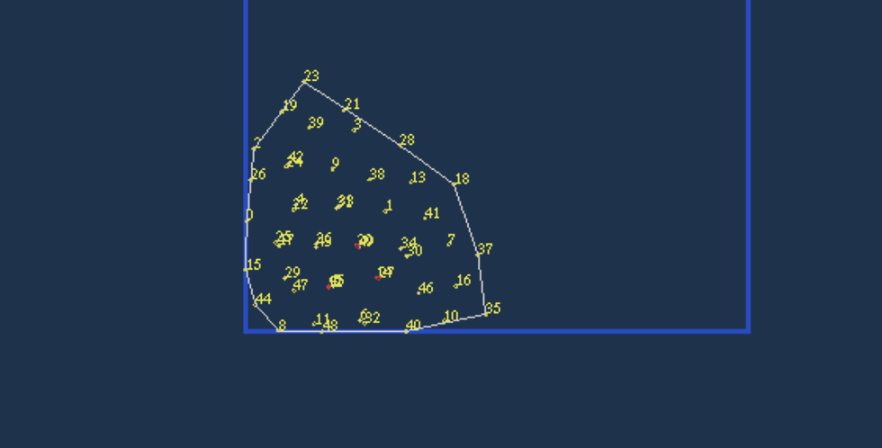
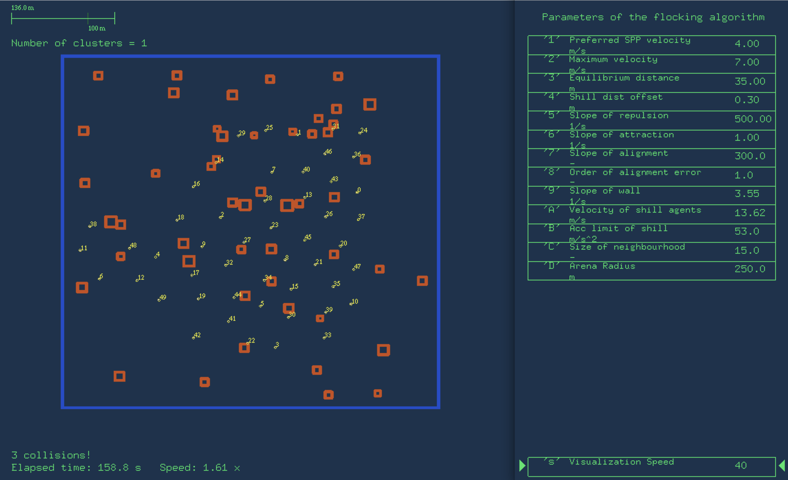
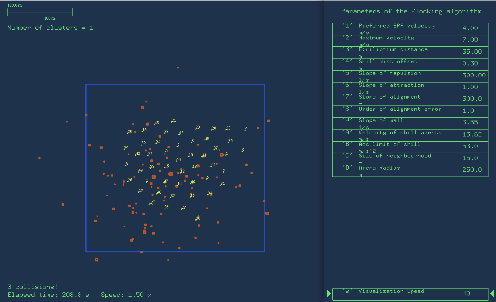
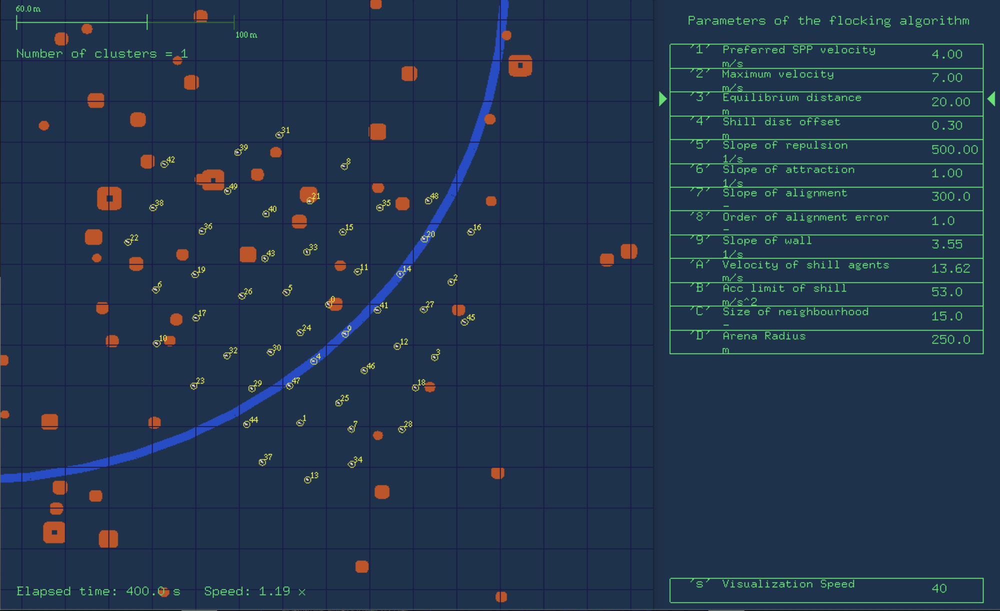
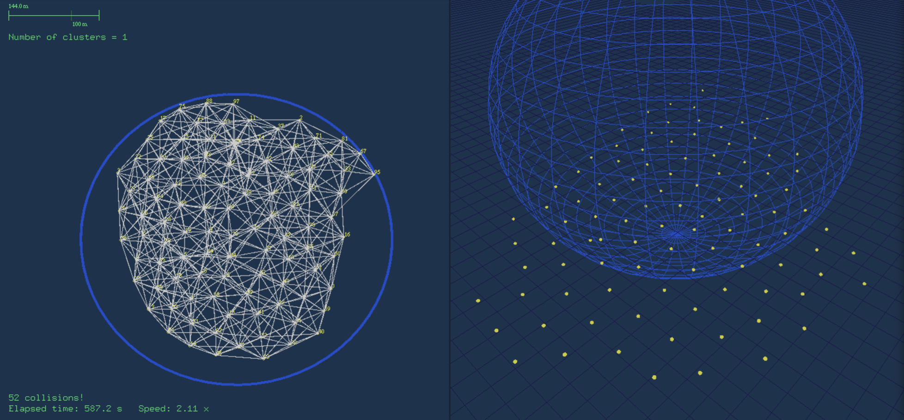

# Flocking Algorithm


## Trois Interactions

$$
u_i=u_{att}+u_{rep}+u_{align}
$$

> `att` Attraction | `rep` Répulsion | `align` Alignement

### **Attraction et Répulsion**

$$
\vec{u_{a/r_i}}=k(x_i-x_j-x_0)\cdot\vec{n_{ij}}=k(x_{ij}-x_0)\cdot\vec{n_{ij}}
$$

> Le but de cette section est de maintenir les deux agents à la bonne distance l'un de l'autre afin qu'ils ne se séparent pas complètement ou n'entrent pas en collision.
>
> ```c
> UnitVect(DifferenceVector, DifferenceVector);
> // Creates a unit vector (parallel to the input vector) 
> // DifferenceVector = DifferenceVector / abs(DifferenceVector)
> 
> MultiplicateWithScalar(DifferenceVector, DifferenceVector, p_l*DistanceFromNeighbour, Dim_l); 
> // -p_l*DistanceFromNeighbour => si Attraction
> // DifferenceVector = DifferenceVector · k·DistanceFromNeighbour
> 
> VectSum(OutputVelocity, OutputVelocity, DifferenceVector); // sum over
> // OutputVelocity = OutputVelocity + DifferenceVector
> ```
>
> > `OutputVelocity` = $u_{rep}$ 
> >
> > `DistanceFromNeighbour` = $x_{ij}$ 
> >
> > `DifferenceVector` = $\vec{n_{ij}}$ 

### Alignement

$$
\vec{u_{align_i}}=-\mu(\vec{v_i}-\vec{v_j})^\alpha
$$

> La loi de contrôle permettant une modification du vecteur vitesse (module et orientation) peut ici être assimilée à une force de frottement visqueux.
>
> ```c
> VectPow(DifferenceVelocities, DifferenceVelocities, alpha, Dim_l);
> // DifferenceVelocities = DifferenceVelocities^alpha
> 
> MultiplicateWithScalar(DifferenceVelocities, DifferenceVelocities, h, Dim_l);
> // DifferenceVelocities = h · DifferenceVelocities
> 
> VectSum(OutputVelocity, OutputVelocity, DifferenceVelocities); // sum over
> // OutputVelocity = OutputVelocity + DifferenceVector
> ```

### Update

$$
\vec{u_i}=\underbrace{\sum_{j\in N_i}k(x_{ij}-x_0)}_\text{Attraction et Répulsion}-\underbrace{\sum_{j\in N_i}\mu(\vec{v_i}-\vec{v_j})^\alpha}_\text{Alignement}+ \underbrace{\sum_{s\in N_s}u_{is}^{obst}}_\text{Interaction avec Obstacle}
$$


## Initial Parameters for Flocking Model



> D'une part, parameters `Répulsion` et `Attraction` ne sont pas assez importantes en comparaison, ce qui conduit à une "attraction" plus grande que la "répulsion" entre les agents et donc à des collisions entre eux.



> D'une autre part, lorsque les agents se déplacent vers la zone cible, ils se regroupent sur les bords et provoquent de nombreuses collisions, ce qui est dû au fait que le paramètre `Alignement` est trop petit.


## New Parameters for Flocking Model


|      Parameter      | Value  |
| :-----------------: | :----: |
| Slope of Repulsion  | 500.00 |
| Slope of Attraction |  1.00  |
| Slope of Alignment  | 300.0  |

> Des tests approfondis ont montré qu'une faible valeur du paramètre **`Alignement`** amène l'agent à se regrouper autour de la limite dès qu'il entre dans la zone cible, ce qui entraîne une augmentation des collisions. La solution consiste à augmenter la valeur. Ce test est conforme à la logique de l'algorithme. En effet, un alignement élevé signifie que la tendance globale du mouvement est plus cohérente, c'est-à-dire que lorsque l'agent de la tête entre dans la zone cible, il continuera à avancer dans le sens de l'objectif global du mouvement, avec une plus grande "conscience globale". Les paramètres de **`Répulsion`** et  **`Attraction`** doivent être choisis de manière à ce que **`Répulsion`** soit beaucoup plus grand que  **`Attraction`**. Ceci est nécessaire pour éviter les collisions.


## With Obstracle Environment 

### `obst_test.default`



> Les performances sont également bonnes lorsque l'on utilise directement les paramètres avant, avec seulement quelques collision.

### `obstacles_normal_100_12_22_14_56.default`



> Dans cette configuration d'obstacles normalement distribués, cet ensemble de paramètres est encore relativement performant.

### Fine-Tuning Parameter



> Lorsque le paramètre `Equilibrium Distance` a été réduit à 20.00, le modèle s'est bien comporté dans un environnement obstrué et est resté à 0 collision pendant plus de cinq minutes d'expériences où la zone cible était constamment modifiée.
>
> |      Parameter       | Value  |
> | :------------------: | :----: |
> |  Slope of Repulsion  | 500.00 |
> | Slope of Attraction  |  1.00  |
> |  Slope of Alignment  | 300.0  |
> | Equilibrium Distance | 20.00  |
>
> > La vidéo se trouve dans le fichier mp4 ci-joint：


## More Agent



> Les collisions augmentent au fur et à mesure que le nombre d'agents augmente, mais la raison pour laquelle il y a effectivement tant de collisions indiquées est que tous les agents sont initialisés au même endroit, il y a donc forcément beaucoup de collisions au début, si utilise *steadystat* comme metric, il va diminuer.
>
> Les performances peuvent être améliorées en augmentant encore la valeur de la `Equilibrium Distance` et la valeur de la `Répulsion`.